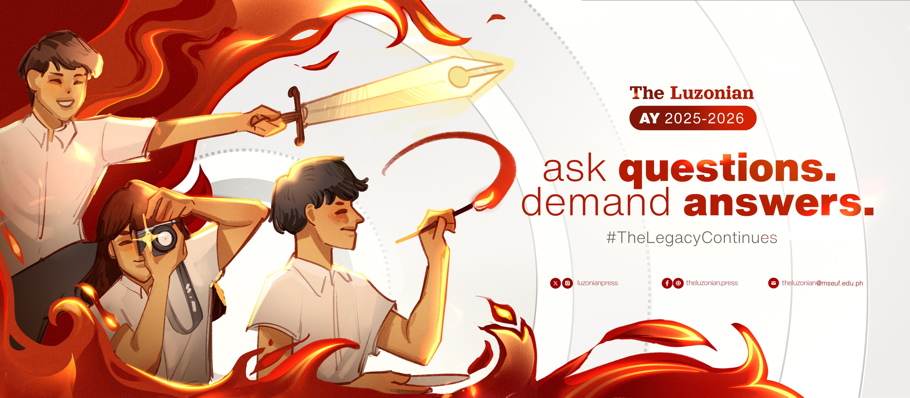

**The Luzonian** is the official collegiate student publication of **Manuel S. Enverga University Foundation (MSEUF), Lucena City**, Quezon Province, Philippines. It serves primarily as a publication for and by the students, reflecting the character of MSEUF as an academic institution. The publication operates under the supervision of the **Office of Student Affairs and Services (OSAS)**.
 
---
 
## Mission
 
The Luzonian strives to uphold journalistic integrity, embrace innovation, combat fake news, disinformation, and misinformation, and promote meaningful discussions for a brighter future in journalism and the Envergan community while championing the values of free expression and free press.
 
## Vision
 
The Luzonian envisions an Envergan community that is informed, engaged, and empowered through responsible journalism as we strive to be the epitome of journalistic excellence, cutting through the noise of fake news, disinformation, and misinformation.
 
## Core Values
 
**Diversity** — We espouse differences in all forms, as reflected through our organization, its publications, and its members.
 
**Accuracy** — We strive for accuracy and truthfulness in all reporting and publishing efforts, adhering to professional standards of journalism.
 
**Ethics** — We value ethical behaviors and demonstrate them in our everyday actions, including maintaining high standards of journalistic integrity and operating responsibly in terms of the environment and finances.
 
**Learning** — We embrace a spirit of learning and growth, both individually and as a team, to continuously improve the quality and impact of the publication.
 
---
 
## Organizational Structure
 
```
Editor in Chief
└── Associate Editor
    ├── Managing Editor for Technical Releases
    │   └── Assistant Managing Editor for Technical Releases
    ├── Managing Editor for Creative Releases
    │   └── Assistant Managing Editor for Creative Releases
    ├── Managing Editor for Operations
    │   └── Assistant Managing Editor for Operations
    ├── Managing Editor for Online Media
    │   └── Assistant Managing Editor for Online Media
    └── Managing Editor for Visual Design
        ├── Assistant Managing Editor for Visual Design
        └── Section Editors
            └── Staff
```
 
### Editorial Board
 
| Position | Role |
|---|---|
| **Editor in Chief** | Chief Executive Officer of the Editorial Board |
| **Associate Editor** | Second-in-command; oversees office rules and editorial standards |
| **Managing Editor for Technical Releases** | Leads tabloid, newsletter, and broadsheet production |
| **Assistant Managing Editor for Technical Releases** | Supports production workflows and editorial coordination |
| **Managing Editor for Creative Releases** | Leads Andamyo, Envergan Magazine, and DAEL Magazine |
| **Assistant Managing Editor for Creative Releases** | Supports creative publication planning and execution |
| **Managing Editor for Operations** | Handles secretarial, administrative, and financial duties |
| **Assistant Managing Editor for Operations** | Supports office administration and operational tasks |
| **Managing Editor for Online Media** | Oversees website, social media, and digital content |
| **Assistant Managing Editor for Online Media** | Supports digital publishing and online engagement |
| **Managing Editor for Visual Design** | Oversees all visual elements, layout, and multimedia assets |
| **Assistant Managing Editor for Visual Design** | Supports visual production and design coordination |
 
### Section Editors & Staff
 
**Section Editors:** News · Opinion · Sports · DevComm · Features · Literary · Layout · Visual
 
**Senior & Junior Staff:** Writers · Artists · Photojournalists · Technical Staff
 
---
 
## Publications & Releases
 
### Regular Releases
- **Newsletter** — Articles on recent University, national, and societal activities
- **Tabloid** — Compact newspaper with pictures and concise articles
- **Broadsheet** — Large-format serious newspaper
- **Literary Folio (Andamyo)** — Themed literary booklet of creative works
 
### Special Releases
- **Envergan Magazine** — Official publication of the University's founding anniversary
- **DAEL Magazine** — Features success stories of students, staff, and alumni
 
The publication releases at least **two publications per semester**, with a mandatory minimum of **two physical publications per academic year**.
 
---
 
## Membership
 
Any bona fide collegiate student of MSEUF is eligible to apply, subject to the following:
 
- No failing grade for two consecutive semesters prior to application
- Exemplary written and verbal communication skills
- Strong command of English and Filipino
- Ability to work under pressure and meet deadlines
- Computer literate and proficient with office productivity tools
 
Members are selected through a **Comprehensive Editorial Examination** covering written, artistic, and visual outputs, followed by a **panel interview**. Membership is valid for one academic year and renewable annually.
 
---
 
## Principles & Mandate
 
The Luzonian maintains a **non-partisan, non-sectarian, and non-political** stance. It adheres to the **1988 Journalist's Code of Ethics** as approved by the Philippines Press Institute, the National Union of Journalists of the Philippines, and the National Press Club.
 
The publication upholds:
- The students' and people's right to know
- Freedom of thought, expression, and the press
- The campus press's duty to pursue truth and social transformation through responsible, active, and advocate journalism
 
---
 
## Find Us
 
| Platform | Handle |
|---|---|
|  Website | [theluzonian.press](https://theluzonian.press) |
|  Facebook | [theluzonian.press](https://www.facebook.com/daelmseuf/) |
|  X / Twitter | [@luzonianpress](https://twitter.com/daelmseuf) |
|  Instagram | [@luzonianpress](https://www.instagram.com/luzonianpress/) |
|  Email | theluzonian@mseuf.edu.ph |
 
---
 
## Awards & Recognition
 
- **Top 4 Performing School in Campus Journalism** — CALABARZON Regional Higher Education Press Conference (RHEPC) 2020 & 2024
- Multiple regional awards in Best Newsletter, Tabloid, Literary Folio, and Magazine
- Individual awards in Editorial Writing, News Writing, Feature Writing, Photojournalism, Layout, Comics, and more
- Consistent qualifier for the **Luzon-wide Higher Education Press Conference (LHEPC)**
 
---
 
*Constitution and By-Laws ratified on July 7, 2023 · Prepared by Josiah Samuel España · Approved by Erika Marca · Noted by John Rover Sinag & Dexter Villamin · AY 2022–2023*
 
*The Luzonian — Official Publication of the Collegiate Student Body, Manuel S. Enverga University Foundation, Lucena City, Quezon, Philippines.*
 